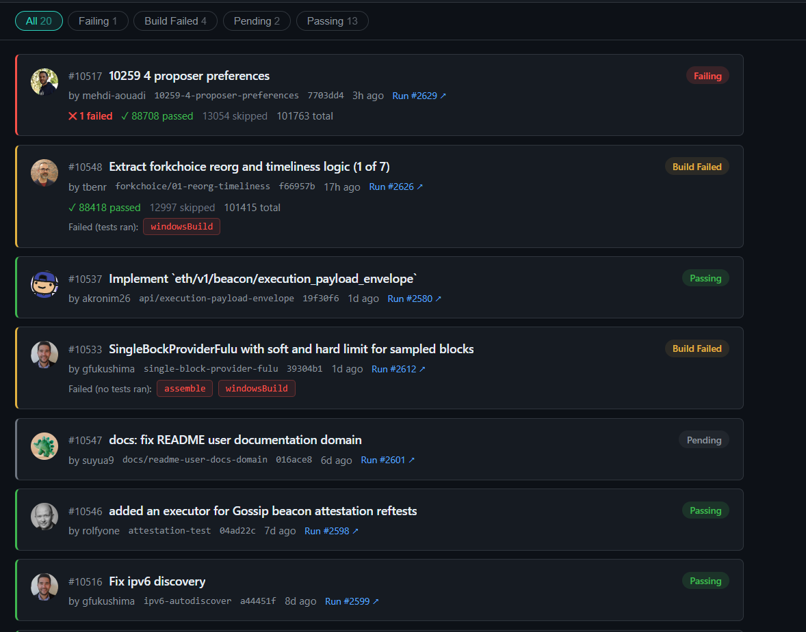

# Teku CI Dashboard

A dashboard for browsing [Teku](https://github.com/Consensys/teku) GitHub Actions CI results across all open pull requests — no manual input required.



## Features

- All open PRs polled automatically — no manual refresh needed
- Passing PRs hidden by default; dashboard shows only failing, building, and pending PRs
- Test counts (passed / failed) shown on each PR card
- Failing tests auto-expanded with assertion message visible immediately; click for full stack trace
- Build-failure detection: distinguishes between a job that failed before tests ran vs a non-test job (e.g. `windowsBuild`) that failed while tests still passed
- Expired artifact fallback: loads test results from GitHub check-run summaries when artifacts have been deleted
- Filter PRs by status: Failing / Building / Build Failed / Pending / Passing
- Search tests by name within any PR

---

## Running

### Prerequisites

- [Node.js 18+](https://nodejs.org)
- A GitHub personal access token — needed to download artifacts from public repos (no special scopes required)

### Step 1 — Install dependencies

```bash
npm install
```

### Step 2 — Start the server

```bash
GITHUB_TOKEN=ghp_your_token_here npm start
```

Open `http://localhost:3000`. The server fetches all open PRs immediately on startup, downloads test artifacts, and begins polling automatically.

---

## How it works

```
Express server (server.js)
├── GET  /api/state   → returns current PR state as JSON
├── POST /api/refresh → triggers an immediate refresh
├── /*                → serves static files from public/
└── Polling loop      → runs every 2 min (30s when any PR is building)
        ├── Fetches all open PRs from GitHub REST API
        ├── For each PR: fetches CI run, artifacts list, and jobs list
        ├── Downloads & parses JUnit XML from test report ZIPs
        ├── Falls back to GitHub check-run summary HTML when artifacts have expired
        └── Stores full results in memory
```

**Polling intervals:** 2 minutes normally; 30 seconds while any PR is still building.

**State storage:** in-memory only — state is rebuilt on restart (first refresh happens immediately).

---

## Requirements

- Node.js 18+
- GitHub personal access token (no special scopes needed for public repos)
